# Safe Cheat Panel

A UI-based cheat panel accessible from the left sidebar in the map menu. Provides tools to edit player stats, inventory, research, blueprints, faction relations, galaxy exploration state, and spawning capabilities - all through a clean, tab-based interface.

**Warning**: Spawning unusual objects (such as multiple Player HQs) can corrupt saves. Use responsibly.

## Important Notice

*Idea Author* made decision to leave the community and removed the original Cheat UI mod. Taking in account his decision to remove all his stuff from the Nexus Mods, I decided to do all my best to replace his part in the latest version of Cheat UI maintained by me and create a new mod called Safe Cheat Panel.

The new mod currently not contains the "development mode" features as I focused on the "safe" features first, but I plan to add them in the future.

Take in account: id of the mod and folder is changed to `safe_cheat_panel`.

## Features

- **Player Tab**: Set player money and add spacesuit upgrades and ammo.
- **Inventory Tab**: Edit player inventory wares across multiple categories.
- **Research Tab**: Unlock or lock research individually, with full dependency handling.
- **Blueprints Tab**: Unlock blueprints individually, by subcategory, or all at once.
- **Factions Tab**: Edit faction relations with the player and between non-player factions.
- **Galaxy/Sectors Tab**: Reveal sectors on the map at three levels of detail, or reveal all at once.
- **Spawner Tab**: Spawn stations, ships (with loadout and crew options), and deployable objects.
- **Right-click context menu**: Spawn station, fix station, spawn ships, spawn objects, force station build completion, teleport ship, teleport player, reveal all stations in sector.
- **Two modes**: **Normal** (player-owned spawns only) and **Extended** (NPC-faction-owned spawns, additional faction options) - switchable via Extension Options.
- **Compatible with X4 8.00 and 9.00**.

## Requirements

- **X4: Foundations**: Version **8.00HF3** or higher and **UI Extensions and HUD**: Version **v8.0.4.0** or higher by [kuertee](https://next.nexusmods.com/profile/kuertee?gameId=2659):
  - Available on Nexus Mods: [UI Extensions and HUD](https://www.nexusmods.com/x4foundations/mods/552)
- **X4: Foundations**: Version **9.00 beta 3** or higher and **UI Extensions and HUD**: Version **v9.0.0.0.3** or higher by [kuertee](https://next.nexusmods.com/profile/kuertee?gameId=2659).
- **Mod Support APIs**: Version 1.95 or higher by [SirNukes](https://next.nexusmods.com/profile/sirnukes?gameId=2659):
  - Available on Nexus Mods: [Mod Support APIs](https://www.nexusmods.com/x4foundations/mods/503)
- **Options Helper**: Version 1.00 or higher by [Chem O`Dun](https://next.nexusmods.com/profile/ChemODun/mods?gameId=2659):
  - Available on Nexus Mods: [Options Helper](https://www.nexusmods.com/x4foundations/mods/2089)

## Installation

- **Nexus Mods**: [Safe Cheat Panel](https://www.nexusmods.com/x4foundations/mods/1971)

## Usage

Open the map and click the **Safe Cheat Panel** icon in the left sidebar to open the panel.

### Player Tab

- Set player money (0 - 1 quadrillion).
- Add spacesuit upgrades.
- Add spacesuit ammo (0 - 10,000).

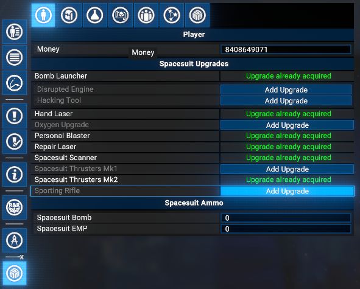

### Inventory Tab

Edit player inventory wares. Items are grouped by category - select a category from the dropdown to view and edit amounts (0 - 10,000).

Categories: Inventory, Modification Parts, Seminars, Curiosities, Luxury Items, and Mission-Only Items.

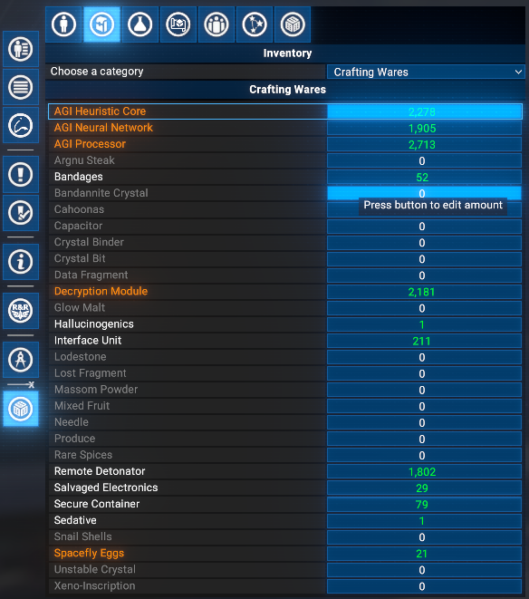
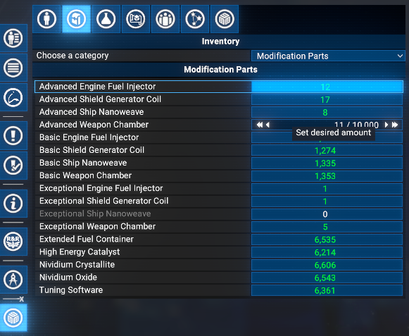
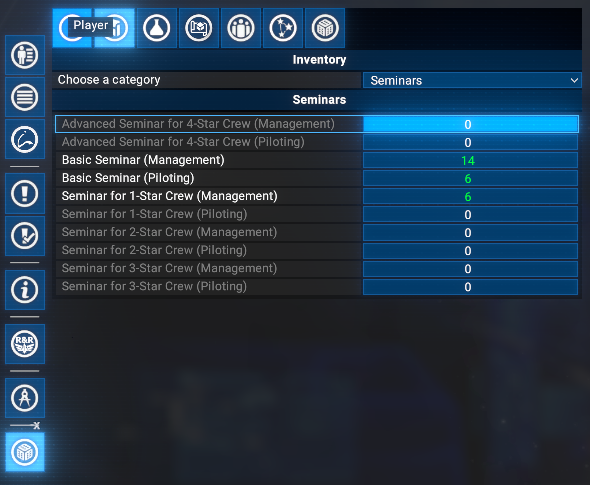

### Research Tab

Shows all available research, more or less hierarchically. Research can be unlocked or locked individually with full dependency handling:

- Unlocking a research item unlocks all of its prerequisites automatically.
- Locking a research item locks all research that depends on it.
- An **Unlock All** button is available at the top of the tab.

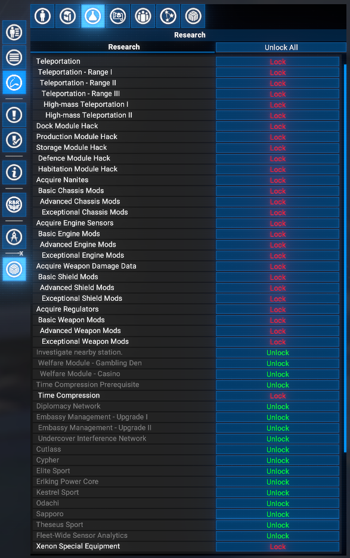

### Blueprints Tab

Browse and unlock blueprints by category and subcategory, or unlock all at once. Individual items can be unlocked within any subcategory. There is no option to lock back blueprints once unlocked.

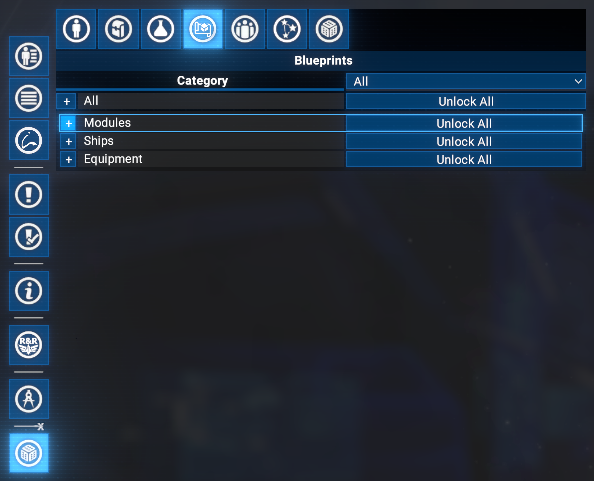
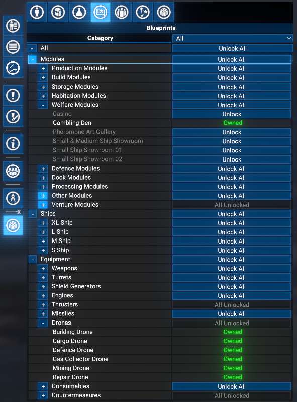
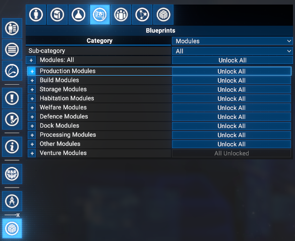

### Factions Tab

- Edit faction relations with the player (-30 to +30, mapped to actual internal values).
- Edit relations between non-player factions (available in extended mode).
- Factions become available as they are discovered in-game.
- Locked relations are shown as read-only.

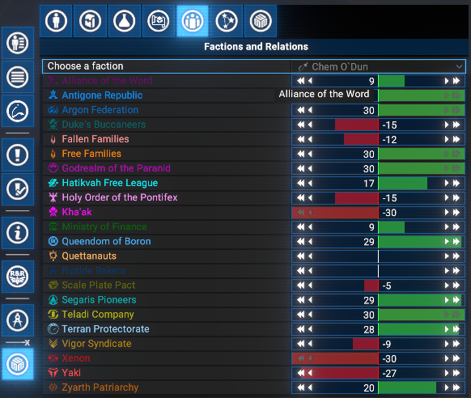
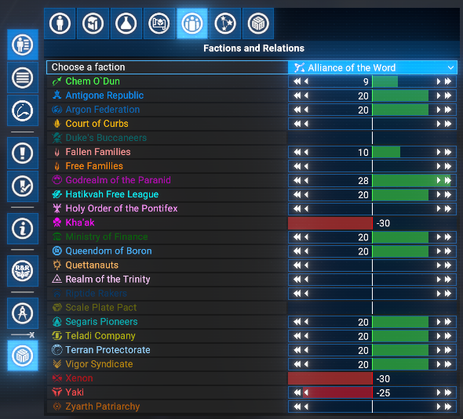

### Galaxy/Sectors Tab

Reveal sectors on the map at three levels of detail:

- **Level 1**: Reveal sector position only.
- **Level 2**: Reveal the path to the sector from the player (or from the nearest known sector if the target is not directly reachable).
- **Level 3**: Reveal all gates and super highways within the sector.

A **Reveal All** button reveals every sector at all levels at once.

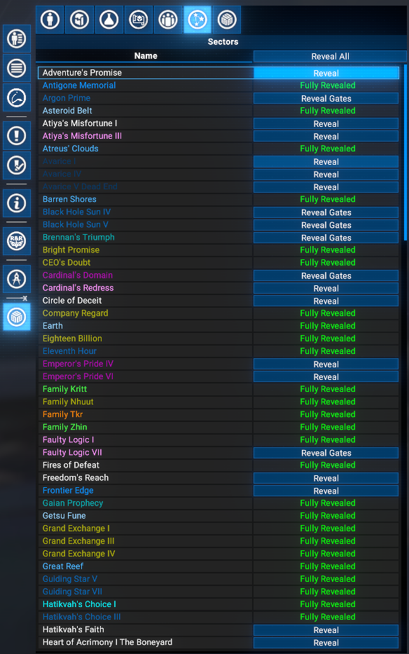

### Spawner Tab

#### Ship Spawner

- Select a ship to spawn.
- Select a loadout (game defaults: Low/Medium/High, or player-defined loadouts).
- Select the owning faction (player only in normal mode; any faction in extended mode).
- Select the crew race (all races available; Kha'ak, Xenon and Drones are not recommended).
- Set the number of ships per row (up to 10) and the number of rows (up to 10).

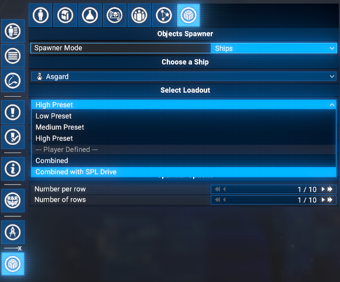
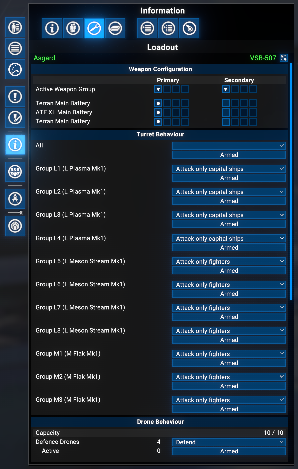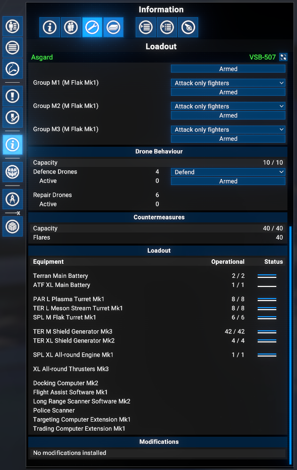
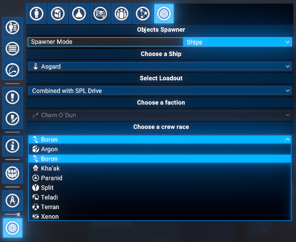
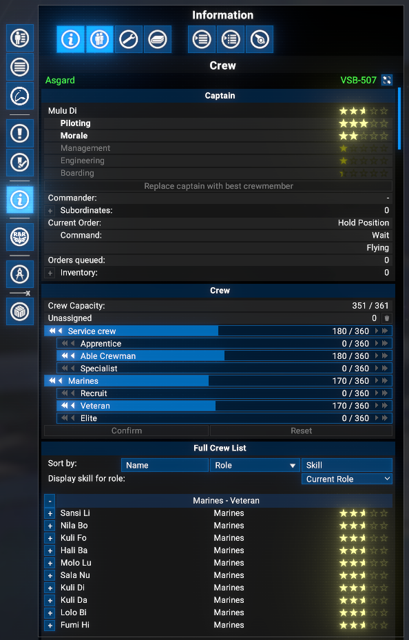

#### Station Spawner

- Select a construction plan (player-created plans, or pre-defined plans in extended mode).
- Select the owning faction (player only in normal mode; any faction in extended mode).
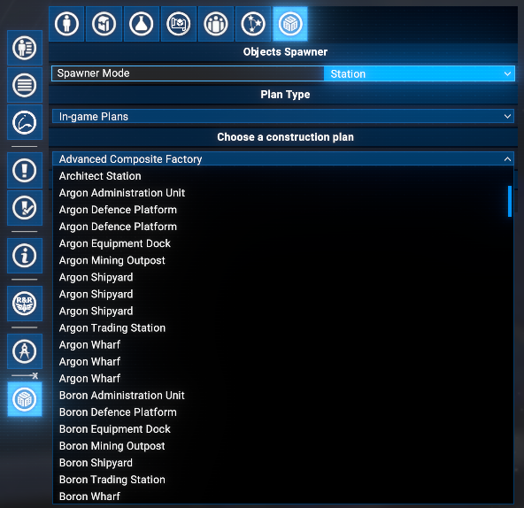

#### Object Spawner

- Select a deployable object to spawn.
- Set the number per row (up to 10), number of rows (up to 10), and spacing between objects (up to 100 km).

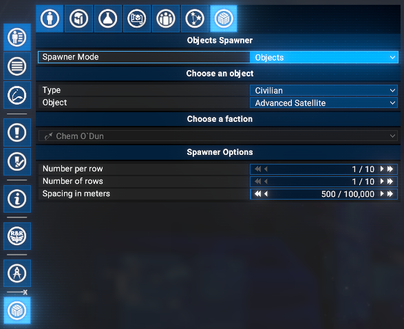

### Right-click Context Menu on Map

Right-clicking on the map gives access to the following actions, depending on the current panel mode and active tab:

- **Spawn Station**: Spawns a station at the clicked position using the current Spawner tab settings.
- **Fix Station**: Appears only on stations that are missing control entities (defence officer or engineer). Initialises the station correctly.
- **Reveal Stations in Sector**: Reveals all stations in the sector of the clicked position on the map, including their names and positions.
- **Spawn Ships**: Spawns ships at the clicked position using the current Spawner tab settings.
- **Spawn Objects**: Spawns deployable objects at the clicked position using the current Spawner tab settings.
  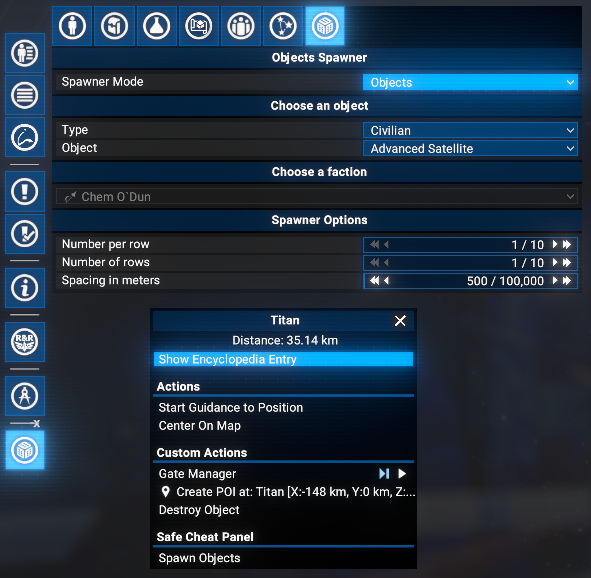
- **Force Build Completion**: Instantly completes the construction of a station that is currently building, by finishing all build tasks and spawning all missing modules and sub-entities. Appears only on stations that are currently under construction.
- **Teleport Here**: Teleports the player's currently piloted ship to the clicked position.
- **Teleport To**: Teleports the player character to the clicked object or position.

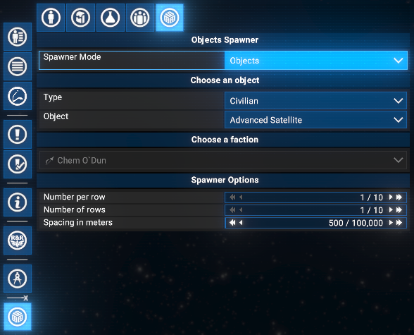

### Extension Options

An options menu is available via **Options Menu > Extension options > Safe Cheat Panel**.

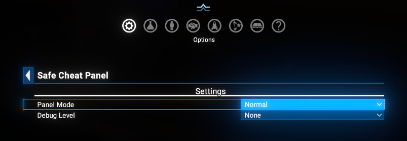

There you can switch between **Normal** and **Extended** modes, which determines the availability of certain features as described in the features section. You can also enable or disable debug logging.

Debug logging can be enabled to write detailed information about the mod's operations to the X4 log file, which is useful for troubleshooting.

## Videos

- [Galaxy/Sectors Tab Demo](https://www.youtube.com/watch?v=VUtxeSGaLhc)

## Credits

- **Author**: Chem O`Dun, on [Nexus Mods](https://next.nexusmods.com/profile/ChemODun/mods?gameId=2659) and [Steam Workshop](https://steamcommunity.com/id/chemodun/myworkshopfiles/?appid=392160)
- *"X4: Foundations"* is a trademark of [Egosoft](https://www.egosoft.com).

## Acknowledgements

- [EGOSOFT](https://www.egosoft.com) - for the X series.
- [kuertee](https://next.nexusmods.com/profile/kuertee?gameId=2659) - for the `UI Extensions and HUD` that makes this extension possible.
- [SirNukes](https://next.nexusmods.com/profile/sirnukes?gameId=2659) - for the `Mod Support APIs` that power the UI hooks and options menu.

## Changelog

### [8.00.33] - 2026-06-03

- **Added**
  - Context Menu Option to force build completion of Stations.

### [8.00.32] - 2026-06-02

- **Added**
  - Context Menu Option to reveal all Stations in a Sector

### [8.00.31] - 2026-06-01

- **Added**
  - Initial public version.
