# Safe Cheat Panel

A UI-based cheat panel accessible from the left sidebar in the map menu. Provides tools to edit player stats, inventory, research, blueprints, faction relations and galaxy exploration state, to spawn and edit ships and stations, and to spawn or destroy objects - all through a clean, tab-based interface.

**Warning**: Spawning unusual objects (such as multiple Player HQs) can corrupt saves. Use responsibly.

## Important Notice

*Idea Author* made decision to leave the community and removed the original Cheat UI mod. Taking in account his decision to remove all his stuff from the Nexus Mods, I decided to do all my best to replace his part in the latest version of Cheat UI maintained by me and create a new mod called Safe Cheat Panel.

The new mod currently not contains the "development mode" features as I focused on the "safe" features first, but I plan to add them in the future.

Take in account: id of the mod and folder is changed to `safe_cheat_panel`.

## Features

- **Player Tab**: Set player money and add spacesuit upgrades and ammo.
- **Inventory Tab**: Edit player inventory wares across multiple categories.
- **Research Tab**: Unlock or lock research individually, with full dependency handling.
- **Blueprints Tab**: Unlock blueprints individually, by subcategory, or all at once.
- **Factions Tab**: Edit faction relations with the player and between non-player factions.
- **Galaxy/Sectors Tab**: Reveal sectors on the map at three levels of detail, or reveal all at once.
- **Spawner Tab**: Spawn stations, ships (loadout, crew skills, job assignment) and deployable objects. Player stations can be given a manager, a ship trader and a starting workforce - none of which the game assigns itself.
- **Editor**: The same tab edits existing objects. Right-click a player-owned ship or station to load it in, then set crew skills, re-equip it, fill empty control posts or set its workforce.
- **Destroy Object Tab**: Destroy any destructible map object, selected via the right-click context menu, with a confirmation checkbox before the button arms.
- **Right-click context menu**: Spawn station, fix station, spawn ships, spawn objects, edit ship, edit station, force station build completion (current and all faction stations), restock station and station build storage (current and all faction stations), teleport ship, teleport player, reveal all stations in sector, destroy object.
- **Two modes**: **Normal** (player-owned spawns only) and **Extended** (NPC-faction-owned spawns, additional faction options) - switchable via Extension Options.
- **Compatible with X4 8.00 and 9.00**.
- **Can work with SWI** - please use with the [kuertee UI Extensions and HUD for SW Interworlds adoption mod](https://www.nexusmods.com/x4foundations/mods/2134).

## Requirements

- **X4: Foundations**: Version **8.00HF3** or higher and **UI Extensions and HUD**: Version **v8.0.4.0** or higher by [kuertee](https://next.nexusmods.com/profile/kuertee?gameId=2659):
  - Available on Nexus Mods: [UI Extensions and HUD](https://www.nexusmods.com/x4foundations/mods/552)
- **X4: Foundations**: Version **9.00 beta 3** or higher and **UI Extensions and HUD**: Version **v9.0.0.0.3** or higher by [kuertee](https://next.nexusmods.com/profile/kuertee?gameId=2659).
- **Mod Support APIs**: Version 1.95 or higher by [SirNukes](https://next.nexusmods.com/profile/sirnukes?gameId=2659):
  - Available on Nexus Mods: [Mod Support APIs](https://www.nexusmods.com/x4foundations/mods/503)
- **Options Helper**: Version 1.00 or higher by [Chem O`Dun](https://next.nexusmods.com/profile/ChemODun/mods?gameId=2659):
  - Available on Nexus Mods: [Options Helper](https://www.nexusmods.com/x4foundations/mods/2089)
- **Print Extension List** by [Chem O`Dun](https://next.nexusmods.com/profile/ChemODun/mods?gameId=2659), version **1.01** or higher. Writes the game version and enabled extensions to the debug log at startup, so any log sent with a bug report identifies the setup:
  - Available on Nexus Mods: [Print Extension List](https://www.nexusmods.com/x4foundations/mods/2191)

## Installation

- **Nexus Mods**: [Safe Cheat Panel](https://www.nexusmods.com/x4foundations/mods/1971)

## Usage

Open the map and click the **Safe Cheat Panel** icon in the left sidebar to open the panel.

### Player Tab

- Set player money (0 - 1 quadrillion).
- Add spacesuit upgrades.
- Add spacesuit ammo (0 - 10,000).

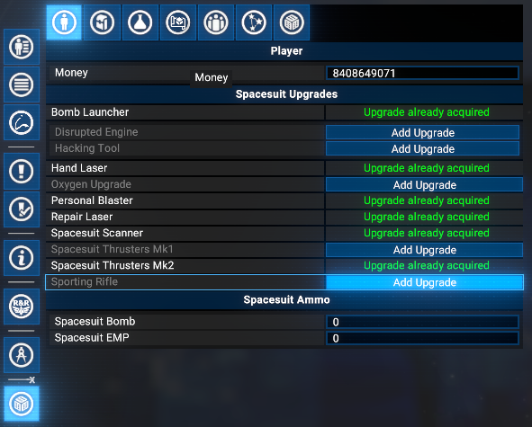

### Inventory Tab

Edit player inventory wares. Items are grouped by category - select a category from the dropdown to view and edit amounts (0 - 10,000).

Categories: Inventory, Modification Parts, Seminars, Curiosities, Luxury Items, and Mission-Only Items.

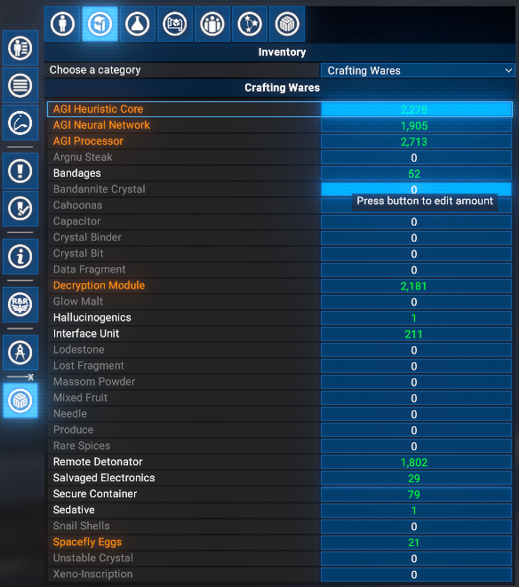
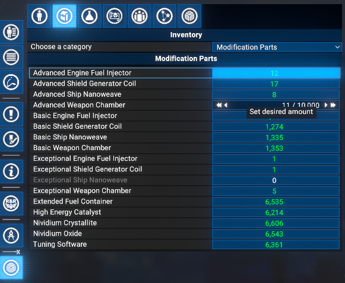
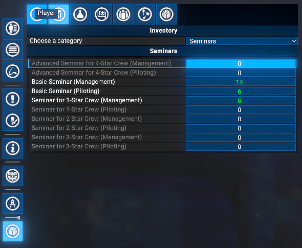

### Research Tab

Shows all available research, more or less hierarchically. Research can be unlocked or locked individually with full dependency handling:

- Unlocking a research item unlocks all of its prerequisites automatically.
- Locking a research item locks all research that depends on it.
- An **Unlock All** button is available at the top of the tab.

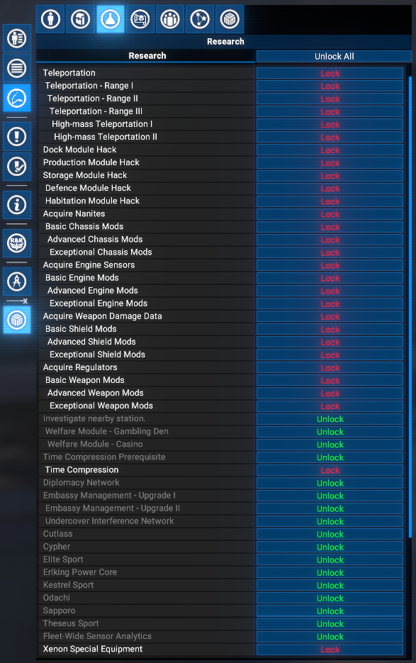

### Blueprints Tab

Browse and unlock blueprints by category and subcategory, or unlock all at once. Individual items can be unlocked within any subcategory. There is no option to lock back blueprints once unlocked.

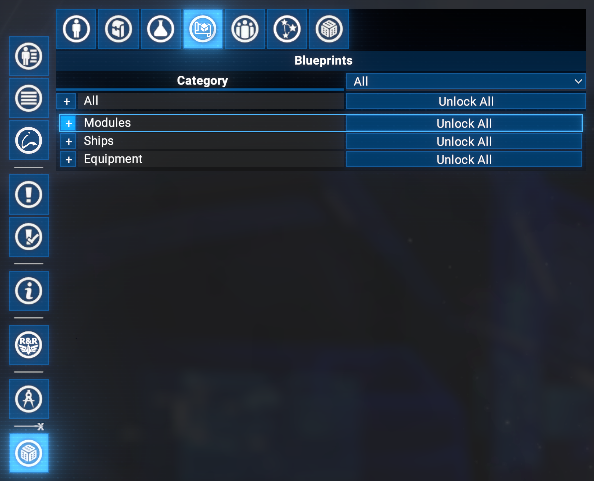
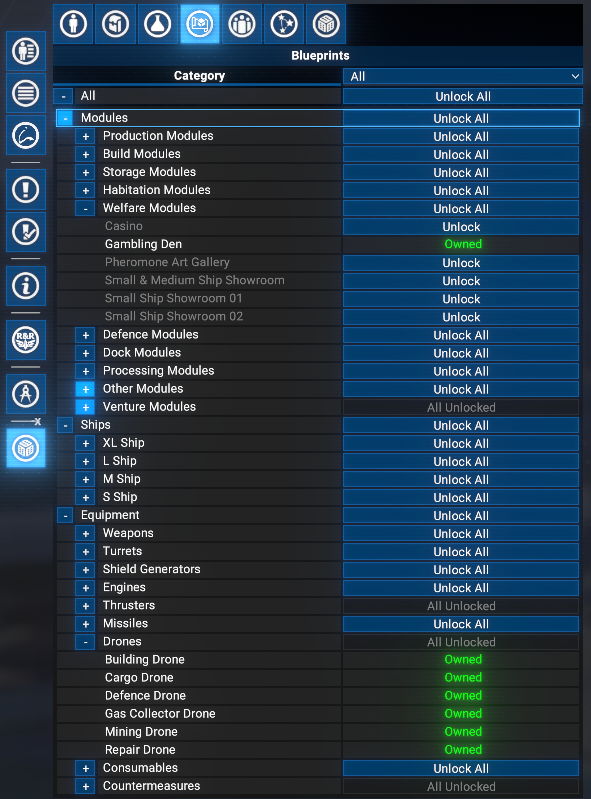
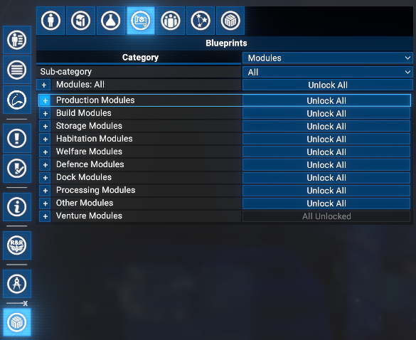

### Factions Tab

- Edit faction relations with the player (-30 to +30, mapped to actual internal values).
- Edit relations between non-player factions (available in extended mode).
- Factions become available as they are discovered in-game.
- Locked relations are shown as read-only.

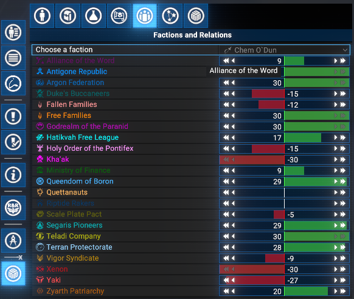
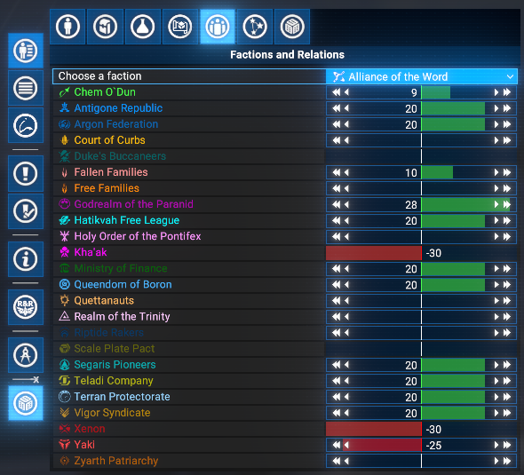

### Galaxy/Sectors Tab

Reveal sectors on the map at three levels of detail:

- **Level 1**: Reveal sector position only.
- **Level 2**: Reveal the path to the sector from the player (or from the nearest known sector if the target is not directly reachable).
- **Level 3**: Reveal all gates and super highways within the sector.

A **Reveal All** button reveals every sector at all levels at once.

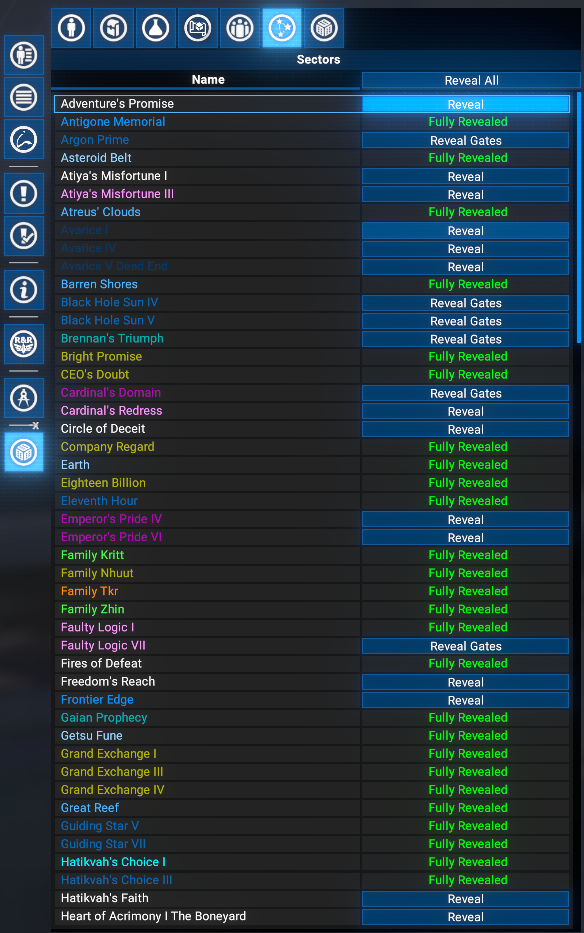

### Spawner Tab

#### Ship Spawner

- Select a ship to spawn.
- Select a loadout (game defaults: Low/Medium/High, or player-defined loadouts).
- Select the owning faction (player only in normal mode; any faction in extended mode).
- Select the crew race (all races available; Kha'ak, Xenon and Drones are not recommended).
- For non-player-owned ships, optionally assign a basic job (Trade, Mine, Salvage, Build, or Fight); only jobs that fit the selected ship are offered, with the best match pre-selected.
- Set how big the crew is and how it is made up, with two sliders: the crew as a percentage of the ship's crew capacity (the pilot is not counted), and how much of that crew are marines rather than service crew. Both start at a full crew split down the middle, and they override whatever the loadout would have crewed.
- Optionally set Pilot/Captain, Marines and Service Crew skill levels via 1-5 star sliders. Left off, the crew keeps the loadout preset's randomised range.
- Set the number of ships per row (up to 10) and the number of rows (up to 10).

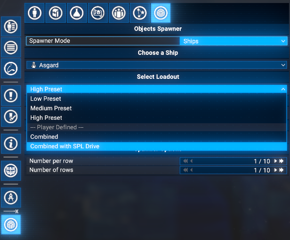
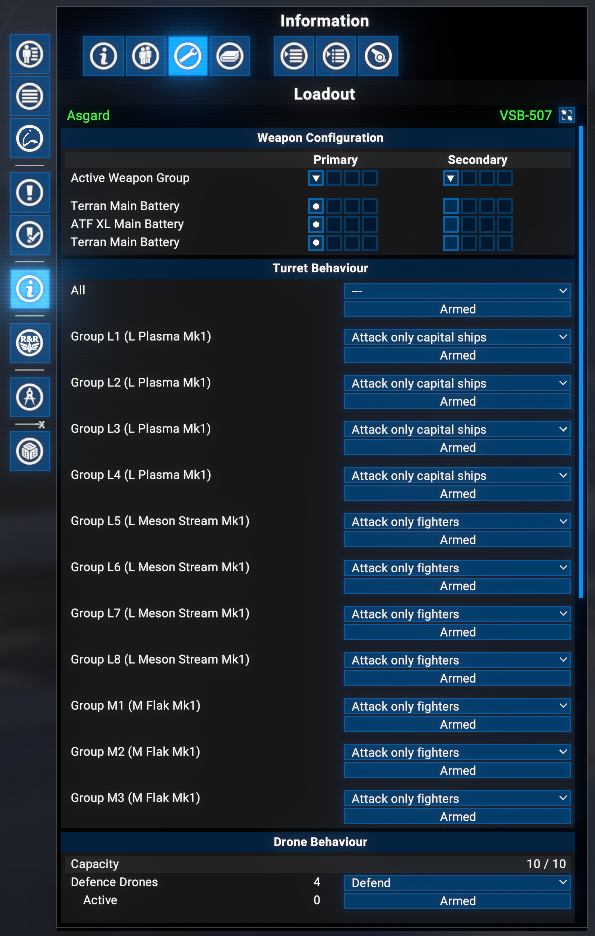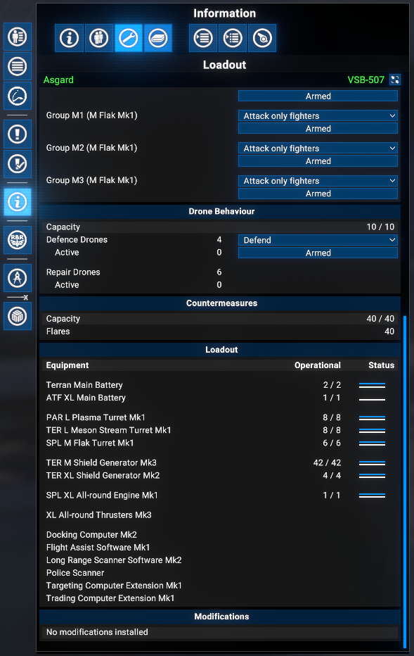
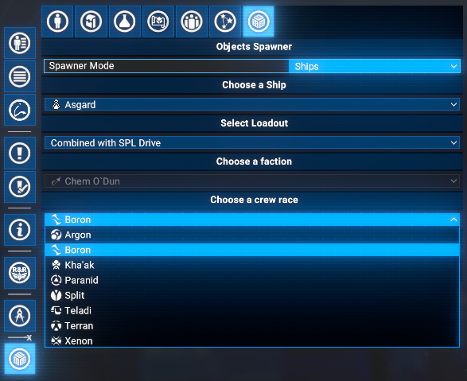
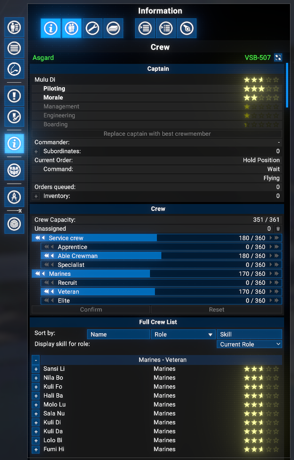
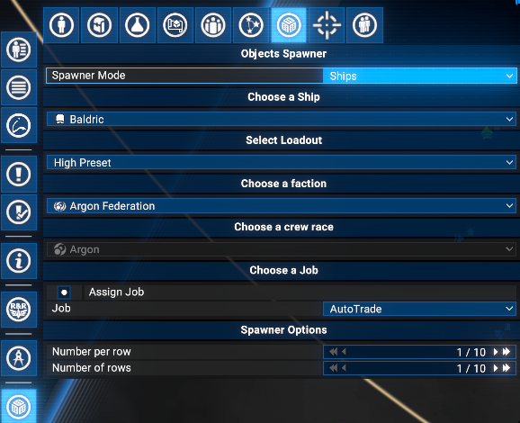

#### Station Spawner

- Select a construction plan (player-created plans, and pre-defined plans in extended mode).
- Select the owning faction (player only in normal mode; any faction in extended mode).
- For a player-owned station, optionally assign a manager and a ship trader - the game gives neither on its own. The trader option appears only when the plan includes a build module.
- Optionally set crew skill levels via 1-5 star sliders. Defence Officer and Engineer are always listed; Manager and Ship Trader only if you asked for them.
- Optionally set the workforce, as a percentage of habitation capacity - a player station otherwise starts with none. Needs a plan with habitation modules; every race fills proportionally.

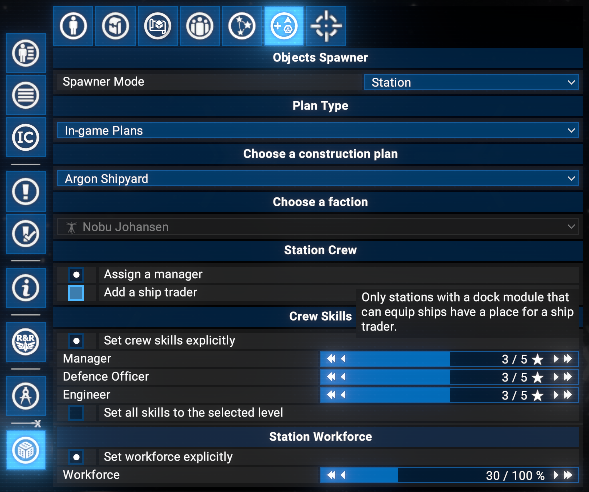

#### Object Spawner

- Select a deployable object to spawn.
- Set the number per row (up to 10), number of rows (up to 10), and spacing between objects (up to 100 km).

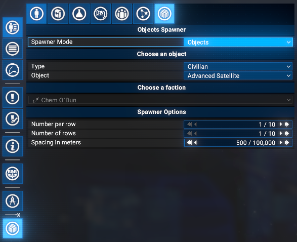

#### Editing an Existing Ship or Station

Right-click a player-owned ship or station while the Spawner tab is open and choose **Edit Ship** or **Edit Station**. The tab switches to edit mode and loads its current configuration. Spawning is unavailable until it is released; right-clicking another object switches to it.

For a ship:

- The ship itself is shown but cannot be changed.
- The loadout dropdown shows what the ship matches: a named loadout exactly, a fully-filled ship as **High**, anything else as **Custom**. Low and Medium are never claimed - the game varies them too much to tell apart.
- Picking a different loadout re-equips the ship on apply. Leaving it alone never touches its equipment.
- The crew race is shown for information only, or **Mixed** when they differ.
- The same two crew sliders as on a spawn, but starting on what the ship actually has, so an untouched slider changes nothing. Raising the crew hires; lowering it dismisses the weakest first. Moving the marine share re-assigns crew already on board before anybody is dismissed.
- Set Pilot/Captain, Marines and Service Crew skill levels via 1-5 star sliders; each label shows the current average.

For a station:

- The construction plan is identified against your saved and in-game plans, or shown as **Unknown**. It cannot be changed.
- A missing manager or ship trader can be added; the trader needs a station with a dock that can equip ships.
- Set Manager, Ship Trader, Defence Officer and Engineer skill levels via 1-5 star sliders. A post that is neither filled nor being added gets no slider.
- The Ship Trader has no skill relevance of its own, so its rating is the plain average of its five skills, and setting it writes all five.
- The workforce can be set as on a spawn. The slider starts on the station's current fill, so an untouched slider changes nothing; a lower value sends workers away.

In both cases:

- By default only the skills relevant to the role or post are set exactly; the rest are scaled proportionally to their current values.
- An optional checkbox sets **every** skill to the chosen level instead.
- **Cancel** releases the object and drops pending changes; **Reset** reverts them but keeps it loaded; **Apply** commits.

### Destroy Object Tab

- The target object can only be set via the **Destroy Object** right-click context menu action, which is only offered while this tab is open.
- Shows the selected object's name, ID code, and sector.
- A confirmation checkbox must be ticked before the **Destroy** button becomes active.
- The player's own currently-piloted ship, gates, highway entry/exit gates, and super highways cannot be targeted.
- The object is removed instantly, without an explosion.

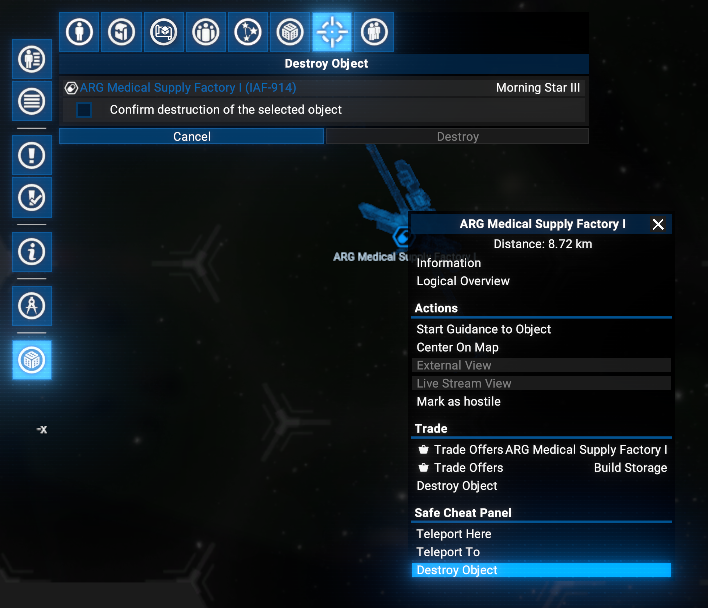

### Right-click Context Menu on Map

Right-clicking on the map gives access to the following actions, depending on the current panel mode and active tab:

- **Spawn Station**: Spawns a station at the clicked position using the current Spawner tab settings.
- **Fix Station**: Appears only on stations that are missing control entities (defence officer or engineer). Initialises the station correctly.
- **Reveal Stations in Sector**: Reveals all stations in the sector of the clicked position on the map, including their names and positions.
- **Spawn Ships**: Spawns ships at the clicked position using the current Spawner tab settings.
- **Spawn Objects**: Spawns deployable objects at the clicked position using the current Spawner tab settings.
- **Force Build Completion: Current Station**: Instantly completes the construction of a station that is currently building, by finishing all build tasks and spawning all missing modules and sub-entities. Appears only on stations that are currently under construction. *In* **extended** *mode available for non-player faction stations*.
- **Force Build Completion: All Faction Stations**: Instantly completes the construction of all stations belonging to the same faction, by finishing all build tasks and spawning all missing modules and sub-entities. Appears only on stations that are currently under construction. *Only available in* **extended** *mode, as for player as for non-player faction stations*.
- **Restock: Current Station**: Instantly restocks the current station with all required resources. Appears only on stations that are currently under construction. Takes into account the trade offers and ware reservation. *In* **extended** *mode available for non-player faction stations*.
- **Restock: All Faction Stations**: Instantly restocks all stations belonging to the same faction with all required resources. Appears only on stations that are currently under construction. Takes into account the trade offers and ware reservation. *Only available in* **extended** *mode, as for player as for non-player faction stations*.
- **Restock: Current Build Storage**: Instantly restocks the current station's build storage with all required resources. Appears only on stations that are currently under construction. Takes into account the trade offers and ware reservation. *In* **extended** *mode available for non-player faction stations*.
- **Restock: All Faction Build Storages**: Instantly restocks all stations belonging to the same faction with all required resources in their build storages. Appears only on stations that are currently under construction. Takes into account the trade offers and ware reservation. *Only available in* **extended** *mode, as for player as for non-player faction stations*.
- **Teleport Here**: Teleports the player's currently piloted ship to the clicked position.
- **Teleport To**: Teleports the player character to the clicked object or position.
- **Destroy Object**: Sets the clicked object as the target on the Destroy Object tab. Only offered while that tab is open. The player's own currently-piloted ship, gates, highway entry/exit gates, and super highways cannot be targeted.
- **Edit Ship**: Loads the clicked ship into the Spawner tab for editing. Only offered while that tab is open, and only for player-owned ships. Stays available while another object is loaded, so you can switch targets directly.
- **Edit Station**: Loads the clicked station into the Spawner tab for editing. Same conditions as above.

### Extension Options

An options menu is available via **Options Menu > Extension options > Safe Cheat Panel**.

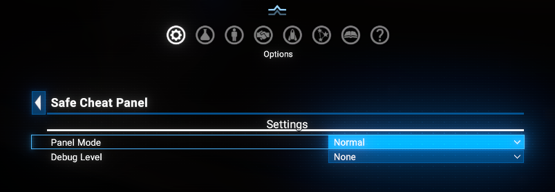

There you can switch between **Normal** and **Extended** modes, which determines the availability of certain features as described in the features section. You can also enable or disable debug logging.

Debug logging can be enabled to write detailed information about the mod's operations to the X4 log file, which is useful for troubleshooting.

## Videos

- [Galaxy/Sectors Tab Demo](https://www.youtube.com/watch?v=VUtxeSGaLhc)

## Credits

- **Author**: Chem O`Dun, on [Nexus Mods](https://next.nexusmods.com/profile/ChemODun/mods?gameId=2659) and [Steam Workshop](https://steamcommunity.com/id/chemodun/myworkshopfiles/?appid=392160)
- *"X4: Foundations"* is a trademark of [Egosoft](https://www.egosoft.com).

## Acknowledgements

- [EGOSOFT](https://www.egosoft.com) - for the X series.
- [kuertee](https://next.nexusmods.com/profile/kuertee?gameId=2659) - for the `UI Extensions and HUD` that makes this extension possible.
- [SirNukes](https://next.nexusmods.com/profile/sirnukes?gameId=2659) - for the `Mod Support APIs` that power the UI hooks and options menu.

## Changelog

### [8.00.39] - 2026-08-??

- **Added**
  - Spawner tab **Edit Mode**: right-click a player-owned ship or station to load it in, then set crew skills, re-equip a ship, fill a station's empty control posts or change its workforce.
  - Edit mode identifies the loadout or construction plan an object was built from.
  - Crew size and composition sliders for ships, on a spawn and in edit mode: how full the crew is, and how much of it are marines rather than service crew.
  - Crew skill levels can be set exactly on a spawn, not just left to the loadout preset.
  - Player stations can be spawned with a manager, and wharfs, shipyards and equipment docks with a ship trader.
  - Station workforce can be set as a percentage of habitation capacity, on a spawn and in edit mode.
- **Changed**
  - The Promote Crew tab is gone - its functions moved to the Spawner tab's edit mode.
  - The Spawner tab has its own icon.
- **Fixed**
  - "Set all skills to the selected level" counts as a change on its own now, so Reset and Apply react to it.

### [8.00.38] - 2026-08-04

- **Fixed**
  - Ships spawned with a Low/Medium/High loadout were missing equipment they should have had: empty gun slots or engine, most shield slots on large ships. I.e. Sapporo spawn is fixed now!
- **Added**
  - Station Spawner: player-developed construction plans can now be spawned for any faction, not just for the player.
  - Ship Spawner: optional job assignment (Trade, Mine, Salvage, Build, Fight) for non-player-owned spawns, limited to jobs that fit the selected ship and pre-selected to the best match.
- **Changed**
  - Now requires the `Print Extension List` mod for debugging purposes.

### [8.00.37] - 2026-07-18

- **Added**
  - Destroy Object tab: destroy any destructible map object.
  - Promote Crew tab: set a player ship's Pilot/Captain, Marines, and Service Crew skill levels via 1-5 star sliders.

### [8.00.36] - 2026-07-09

- **Fixed**
  - `insertLuaAction` crashing (and breaking the whole map interact menu) when another mod registered its own custom Lua action via kuertee's shared callback, since SCP dereferenced its action data without checking it belonged to SCP.
  - `rowgroup:addRow() Disconnected row group detected` errors on the Player tab (spacesuit upgrades list) caused by mixing grouped and ungrouped rows in the same list.

### [8.00.35] - 2026-06-09

- **Added**
  - Context Menu Option to force build completion of all faction stations.
  - Context Menu Option to restock station and station build storage (current and all faction stations).

### [8.00.34] - 2026-06-04

- **Fixed**
  - Context menu disappearing in some cases (legacy issue).

### [8.00.33] - 2026-06-03

- **Added**
  - Context Menu Option to force build completion of Stations.

### [8.00.32] - 2026-06-02

- **Added**
  - Context Menu Option to reveal all Stations in a Sector

### [8.00.31] - 2026-06-01

- **Added**
  - Initial public version.
